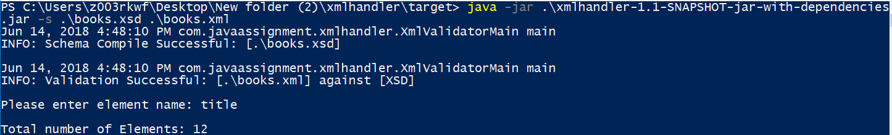
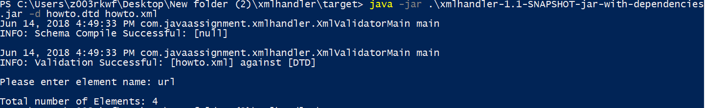

# XML Handler

To verify if the Schema compiles:

    $ java -jar .\xmlhandler-1.1-SNAPSHOT-jar-with-dependencies.jar -s .\books.xsd

To validate an XML against a XSD schema:

    $ java -jar .\xmlhandler-1.1-SNAPSHOT-jar-with-dependencies.jar -s .\books.xsd .\books.xml

After successful validation, enter the certain name of element on XML file.
Then, program returns the number of element which is given.

To validate an XML against a DTD schema:

    $ java -jar .\xmlhandler-1.1-SNAPSHOT-jar-with-dependencies.jar -d .\howto.dtd .\howto.xml

After successful validation, enter the certain name of element on XML file.
Then, program returns the number of element which is given.

